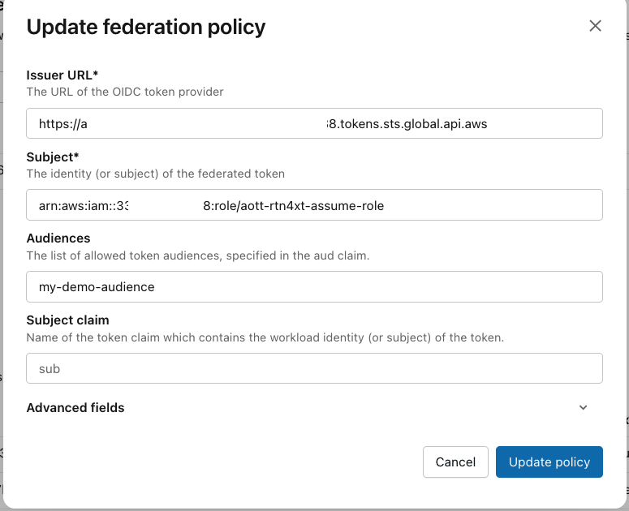

# An example of using AWS outbound identity federation with Databricks Python SDK

This directory contains an example of using [AWS outbound identity federation](https://docs.aws.amazon.com/IAM/latest/UserGuide/id_roles_providers_outbound_getting_started.html) with Databricks Python SDK.   This is done by implementing a custom credential strategy that wraps the `boto3` package and performs the [token exchange under the hood](https://learn.microsoft.com/en-us/azure/databricks/dev-tools/auth/oauth-federation-exchange).

The code is in the `aws-jwt-in-py-sdk.py` file - it instantiates a Databricks workspace client with  the custom credential strategy and lists clusters in the workspace.  To run it you need to install `databricks-sdk` and `boto3` packages (this could be done using the Poetry tool).

You also need to specify audience, and other parameters in the code (lines 10-16).   You need to configure service principal federation policy as described in the [documentation](https://learn.microsoft.com/en-us/azure/databricks/dev-tools/auth/oauth-federation-policy#configure-a-service-principal-federation-policy) (you can configure account-wide policy as well).  Example you can see on the screenshot:

Specific service principal needs to be added into Databricks workspace.  The URL of the Databricks workspace is specified via `DATABRICKS_HOST` environment variable or directly in  the code (line 46).  You also need to specify `CLIENT_ID` environment variable or set in the code (line 47) to trigger service principal federation.